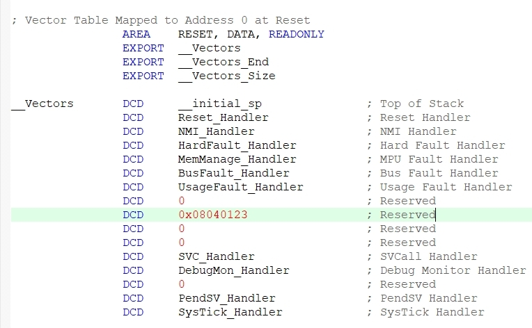
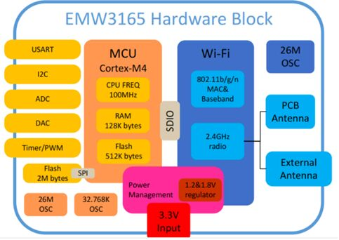

# Bootloader demo

## 說明

+ 使用 STM32CubMX 初始化專案
  + 專案配置使用 STM32F412RET
  + 實機測試使用 EMW3165 開發板 (STM32F411CE)
    + 使用晶片內部的 rc 振盪器 (16MHz)  
  
## MCU 記憶體配置

| Usage         | Size  | Range                     | Note                    |
| -------------:| ----: | :-----------------------: | :---------------------- |
| Bootloader    |  16KB | 0x08000000 ~ 0x08003FFF   | Flash sector 0          |
| Reserved      |  16KB | 0x08004000 ~ 0x08007FFF   | Flash sector 1          |  
| DFU           | 244KB | 0x08008000 ~ 0x0803FFFF   | Flash sector 2, 3, 4, 5 |
| Application   | 256KB | 0x08040000 ~ 0x0807FFFF   | Flash sector 6, 7       |
| BCB Magic     | 4 B | 0x2001FFFC ~ 0x2001FFFF   | on-chip SRAM            |

+ *註: BCB = Block Ctrl Block (讓 Application 觸發後, 重開機執行 bootloader 的 DFU 模式)*
  + *當 application 將 BCB Magic 設為 0x12345678 後重開機會強制進入 dfu mode*

## DFU 檔案說明

+ bootloader.c : 負責開機後轉跳到 Application 執行, 以及 DFU 的模式

+ spl.c : Serial Protocol Layer, 負責打包通訊內容以及拆包通訊內容
  + SPL format: [preamble] [payload size] [payload] [check sum]
    + [preamble]: 2 bytes
    + [payload size]: 2 bytes
    + [payload]: n bytes
    + [check sum]: 2 bytes

## DFU 啟動條件

+ BCB Magic (0x2001FFFC) 被設定為 0x12345678
+ application signature 不合法 (包含檔案不存在)
+ application check sum 不正確

## DUF 交握流程

|Step|Device|Action| Host|
|:-:|:-:| :- | :-: |
|1|STM32F412| ----- dfu start request -----------------------> |PC|
|2|STM32F412| <---- dfu start respons ----------------------- |PC|
|3|STM32F412| ----- dfu image size request ----------------> |PC|
|4|STM32F412| <---- dfu image size -------------------------- |PC|
|5|STM32F412| ----- dfu image chksum request ------------> |PC|
|6|STM32F412| <---- dfu image chksum ---------------------- |PC|
|7|STM32F412| erase dfu flash | |
|8|STM32F412| ----- dfu image segment data request ------> |PC|
|9|STM32F412| <---- dfu image segment data --------------- |PC|
|10|STM32F412| ----- dfu image segment chksum request ---> |PC|
|11|STM32F412| <---- dfu image segment chksum ------------ |PC|
|12|STM32F412|repeat step 8~11, until download whole image|PC|
|13|STM32F412|dfu image signature validaion
|14|STM32F412|integrity of dfu image on dfu flash validaion
|15|STM32F412|erase app flash
|16|STM32F412|copy dfu image to app flash
|17|STM32F412|application validaion
|18|STM32F412|write app size on app flash
|19|STM32F412|write app chksum on app flash
|20|STM32F412|----- dfu completer request ------------------> |PC|
|21|STM32F412|reboot

## DUF 工具程式

+ dfu_tool.exe 是由 python script 打包成的執行檔
+ dfu_tool.exe 更新韌體, 使用方式如下: dfu_tool.exe [序列埠名稱] [韌體檔案路徑]

  ```cmd
  D:\> dfu_tool.exe COM13 d2.bin
  ```     
+ 開啟 console 後, 第一次執行 dfu_tool.exe 時會因為要載入動態 lib 所以會慢 3~4 秒
+ 下載路徑
  + [dfu_tool.exe](/tools/dfu_tool.exe)
  + [d2.bin](/tools/d2.bin)
  + [d3.bin](/tools/d3.bin)

## Application 開發注意事項

+ application 必需在中斷向量表中 0x20 的位置填內 0x08040123 如下圖
+ bootloader 在開機流程或 DFU 模式, 都會透過這個 signature 來判定韌體的合法性
+ signature 只是隨便選一個向量表中沒有使用的位置來放
+ signature 的值 0x08040123 也是一個隨機定義的

  

## Application 觸發 dfu 的方法

+ 首先 bootloader 在設計期間要將 0x2001FFFC 設為 NOINIT
  + 避免重置後 0x2001FFFC 被初始化為 0
+ 要觸發 dfu 模式時, 將 0x2001FFFC 設為 0x12345678 後重置 MCU 就會進入 bootloader 的 dfu 模式

## io 配置如下

  

## 其它

+ 開發板相關文件在 doc 資料夾底下

+ 開發板核心模式架構

  
