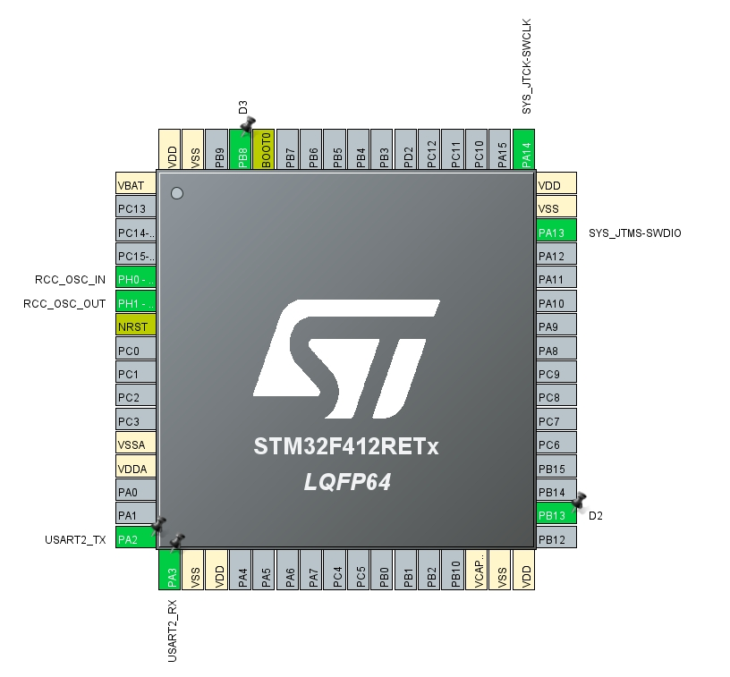
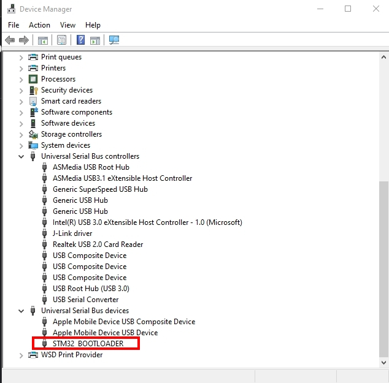

# xyzDemo

## 說明

+ 使用 STM32CubMX 初始化專案
  
+ flash 配置:
    |FW|BEGIN|END|
    |:-----| ----: | :----: |
    |bootloader|0x8000000|0x8003FFF|
    |application|0x8004000|0x8080000|

+ io 配置如下:

+ bootloader 動作流程:
  
  1. 透過 UART2 列印 "Welcome!!! This is bootloader."
  2. 0.5 秒 Toggle D2/D3 一次, 共 5 次
  3. 是否強制進入更新模式 ( Dfu 模式 )
  4. 檢查位置 0x8004000 是否有合法的 application 中斷向量表, 沒有的話回傳位置 0
  5. 執行 HAL_DeInit(), 重置所有週邊
  6. 停止所有的中斷, 並清除所有待辦的中斷旗標
  7. 停止 Systick
  8. 依步驟 4.的結果決定是轉跳到 application 執行, 或是啟動 ROM code 的 bootloader 更新 (使用 STM32CubeProgramer 透過 USB 可偵測到).
  
